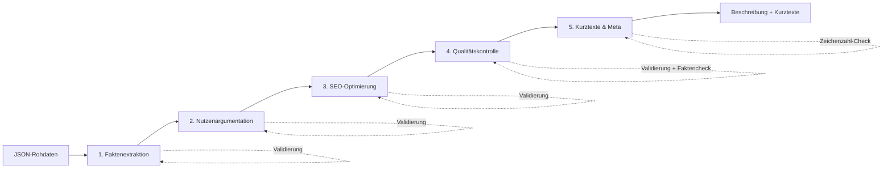

# Case Study: KI-gestützte Produktbeschreibungen für Baumärkte

[](https://www.php.net/)
[](LICENSE)
[](https://buymeacoffee.com/martin.willig)

> **Ziel:** Automatisierte Generierung von SEO-optimierten Produktbeschreibungen mittels KI — lokal (LM Studio) oder über Cloud-APIs (OpenAI, Anthropic) — von Rohdaten bis zur Browser-Darstellung.

---

## Inhaltsverzeichnis

1. [Überblick](#überblick)
2. [Technischer Ansatz](#technischer-ansatz)
3. [Projektstruktur](#projektstruktur)
4. [Installation & Konfiguration](#installation--konfiguration)
5. [Verwendung](#verwendung)
6. [Konfiguration im Detail](#konfiguration-im-detail)
7. [Anpassungen](#anpassungen)

---

## Überblick

### Problemstellung

Baumärkte haben tausende Produkte, aber oft nur technische Datenblätter ohne verkaufsfördernde Beschreibungen. Manuelles Texten ist zeitaufwändig und teuer.

### Lösung

Eine 5-stufige KI-Pipeline, die aus strukturierten Produktdaten (JSON) hochwertige, SEO-optimierte Beschreibungen generiert. Die Pipeline unterstützt lokale Modelle (LM Studio mit Gemma, Llama, etc.) und Cloud-APIs (OpenAI, Anthropic).

| Stufe | Aufgabe | Standard-Temperatur |
|-------|---------|---------------------|
| 1 | Faktenextraktion | 0.10 |
| 2 | Nutzenargumentation | 0.35 |
| 3 | SEO-Optimierung | 0.15 |
| 4 | Qualitätskontrolle | 0.05 |
| 5 | Kurztexte & Meta | 0.10 |

Jeder Stage hat eine automatische **Validierung mit Korrektur-Retries**: Wenn die Ausgabe nicht den Qualitätskriterien entspricht (Zeichenzahl, Absatzanzahl, fehlende Fakten), wird der Stage bis zu 2 Mal mit gezieltem Korrektur-Prompt wiederholt.



### Ergebnis

- **Vollständige Produktbeschreibung** (650-850 Zeichen, 3 Absätze)
- **Kurzbeschreibung** für Produktkacheln (80-130 Zeichen)
- **Meta-Description** für Google (140-155 Zeichen)
- **Markdown-Export** mit eingebautem Browser-Viewer

---

## Technischer Ansatz

### Warum eine Multi-Stage-Pipeline?

Ein einzelner Prompt liefert inkonsistente Ergebnisse. Die Aufteilung in spezialisierte Stufen ermöglicht:

- **Präzise Temperatursteuerung** pro Aufgabentyp (kreativ vs. deterministisch)
- **Iterative Verbesserung** des Textes mit Validierung nach jedem Schritt
- **Faktenvalidierung** gegen Originaldaten (einheit-bewusst, kategorie-spezifisch)
- **Konsistente Qualität** über alle Produkte durch Korrektur-Retries
- **Per-Stage Modellwahl** — verschiedene Modelle für verschiedene Aufgaben

### Unterstützte API-Provider

| Provider | System-Rolle | JSON-Schema | Konfiguration |
|----------|:------------:|:-----------:|---------------|
| **LM Studio** (lokal) | Modellabhängig* | Ja | `provider: 'lmstudio'` |
| **OpenAI** | Ja | Ja | `provider: 'openai'` |
| **Anthropic** | Ja | Nein | `provider: 'anthropic'` |

*Gemma-Modelle haben keine System-Rolle — der System-Prompt wird automatisch in die User-Nachricht eingebettet.

### Stack

- **PHP 8.5+** — Pipeline-Ausführung
- **Bash** — Orchestrierung, Pre-Flight-Checks, Logging
- **LM Studio / OpenAI / Anthropic** — KI-Inferenz
- **Empfohlenes lokales Modell:** `google/gemma-3-12b`

---

## Projektstruktur

```
├── generation/                 # KI-Generierung
│   ├── gen-desc.php            # Hauptskript (5-Stufen-Pipeline)
│   ├── gen-markdown.php        # Markdown-Export
│   ├── inc.php                 # Provider-Abstraktion, Validierung, Logging
│   ├── *.conf.php              # Lokale Konfiguration (gitignored)
│   ├── *.conf.example.php      # Konfigurations-Vorlagen
│   └── prompts/                # Prompt-Dateien (provider-unabhängig)
├── scripts/                    # Shell-Skripte für Orchestrierung
│   ├── run.sh                  # Komplett-Pipeline mit Pre-Flight-Checks
│   ├── generate.sh             # Generierung mit Log-Datei
│   ├── export.sh               # Markdown-Export
│   ├── serve.sh                # Web-Viewer starten
│   ├── clear-cache.sh          # Cache leeren
│   └── show-stats.sh           # Statistiken anzeigen
├── server/                     # Browser-Viewer
│   ├── server.php
│   ├── index.html
│   └── style.css
├── products/                   # Generierte Markdown-Dateien
├── logs/                       # Log-Dateien der Generierung
└── test-products.json          # Eingabedaten
```

---

## Installation & Konfiguration

### Voraussetzungen

- PHP 8.5+
- Für lokale Inferenz: LM Studio mit geladenem Modell
- Für Cloud-APIs: API-Key von OpenAI oder Anthropic

### Schnellstart

```bash
# 1. Konfiguration erstellen
cp generation/gen-desc.conf.example.php generation/gen-desc.conf.php
cp generation/gen-markdown.conf.example.php generation/gen-markdown.conf.php

# 2. gen-desc.conf.php anpassen (Provider, Modell, API-Key)

# 3. Komplette Pipeline ausführen
./scripts/run.sh
```

### Konfiguration für verschiedene Provider

**LM Studio (lokal, Standard):**
```php
'provider' => 'lmstudio',
'url'      => 'http://localhost:1234/v1/chat/completions',
'model'    => 'google/gemma-3-12b',
'apiKey'   => '',
```

**OpenAI:**
```php
'provider' => 'openai',
'url'      => 'https://api.openai.com/v1/chat/completions',
'model'    => 'gpt-4o-mini',
'apiKey'   => 'sk-...',
```

**Anthropic:**
```php
'provider' => 'anthropic',
'url'      => 'https://api.anthropic.com/v1/messages',
'model'    => 'claude-sonnet-4-20250514',
'apiKey'   => 'sk-ant-...',
```

---

## Verwendung

### Shell-Skripte (empfohlen)

```bash
# Komplette Pipeline: Pre-Flight → Generierung → Export → Statistiken
./scripts/run.sh

# Mit Cache-Reset (alle Produkte neu generieren)
./scripts/run.sh --force

# Pipeline + anschließend Viewer starten
./scripts/run.sh --serve

# Einzelne Schritte
./scripts/generate.sh              # Nur Generierung
./scripts/generate.sh --force      # Generierung mit Cache-Reset
./scripts/export.sh                # Nur Markdown-Export
./scripts/serve.sh                 # Viewer starten (Port 8000)
./scripts/serve.sh 3000            # Viewer auf anderem Port
./scripts/show-stats.sh            # Letzte Statistiken anzeigen
./scripts/clear-cache.sh           # Cache leeren (mit Bestätigung)
./scripts/clear-cache.sh --yes     # Cache leeren (ohne Bestätigung)
```

### Direkte PHP-Ausführung

```bash
php generation/gen-desc.php
php generation/gen-markdown.php
php -S localhost:8000 -t server server/server.php
```

### Cache-Verwaltung

Die Pipeline speichert verarbeitete Produkte im Cache mit einem Hash der Eingabedaten. Bei Änderung der Produktdaten werden betroffene Produkte automatisch neu generiert. Bei Abbruch werden bereits generierte Produkte beim nächsten Lauf übersprungen.

---

## Konfiguration im Detail

### Per-Stage Modell und Parameter

Jeder Pipeline-Stage kann eigenes Modell, Temperatur und Token-Limit haben:

```php
'stages' => [
    1 => ['model' => null,                  'temperature' => 0.10, 'maxTokens' => null],
    2 => ['model' => 'google/gemma-3-27b',  'temperature' => 0.35, 'maxTokens' => 800],
    3 => ['model' => null,                  'temperature' => 0.15, 'maxTokens' => null],
    4 => ['model' => null,                  'temperature' => 0.05, 'maxTokens' => null],
    5 => ['model' => null,                  'temperature' => 0.10, 'maxTokens' => 200],
],
```

`null`-Werte verwenden den globalen Wert aus der Config.

### Provider-Erkennung

Provider-Fähigkeiten werden automatisch erkannt, können aber manuell überschrieben werden:

```php
'supportsSystemRole' => null,  // null = auto, true/false = manuell
'supportsJsonSchema' => null,  // null = auto, true/false = manuell
```

### Logging

```php
'logFile' => null,                          // Nur Terminal
'logFile' => __DIR__ . '/../logs/gen.log',  // Terminal + Datei
```

Shell-Skripte erstellen automatisch timestamped Log-Dateien in `logs/`.

---

## Anpassungen

| Was | Wo |
|-----|-----|
| API-Provider / Modell | `generation/gen-desc.conf.php` |
| Temperatur pro Stage | `generation/gen-desc.conf.php` → `stages` |
| Modell pro Stage | `generation/gen-desc.conf.php` → `stages` |
| Token-Limit pro Stage | `generation/gen-desc.conf.php` → `stages` |
| Prompt-Texte | `generation/prompts/*.prompt` |
| Validierungsregeln | `generation/inc.php` → `validateStageOutput()` |
| Kritische Spezifikationen | `generation/gen-desc.conf.php` → `criticalKeys` / `categoryCriticalKeys` |
| Markdown-Format | `generation/gen-markdown.php` |
| Viewer-Design | `server/style.css` |

**Prompt-Variablen:** `{{variableName}}` wird automatisch ersetzt. Prompts folgen der Struktur AUFGABE → EINGABE → REGELN → FORMAT → BEISPIEL.

---

## Lizenz

MIT License — Siehe [LICENSE](LICENSE) für Details.
