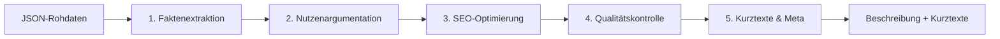

# Case Study: KI-gestützte Produktbeschreibungen für Baumärkte

[](https://www.php.net/)
[](LICENSE)
[](https://buymeacoffee.com/martin.willig)

> **Ziel:** Automatisierte Generierung von SEO-optimierten Produktbeschreibungen mittels lokaler KI (LM Studio) – von Rohdaten bis zur Browser-Darstellung.

---

## Inhaltsverzeichnis

1. [Überblick](#überblick)
2. [Technischer Ansatz](#technischer-ansatz)
3. [Projektstruktur](#projektstruktur)
4. [Installation & Konfiguration](#installation--konfiguration)
5. [Verwendung](#verwendung)
6. [Anpassungen](#anpassungen)

---

## Überblick

### Problemstellung

Baumärkte haben tausende Produkte, aber oft nur technische Datenblätter ohne verkaufsfördernde Beschreibungen. Manuelles Texten ist zeitaufwändig und teuer.

### Lösung

Eine 5-stufige KI-Pipeline, die aus strukturierten Produktdaten (JSON) hochwertige, SEO-optimierte Beschreibungen generiert:

| Stufe | Aufgabe | Temperatur |
|-------|---------|------------|
| 1 | Faktenextraktion | 0.15 |
| 2 | Nutzenargumentation | 0.20 |
| 3 | SEO-Optimierung | 0.15 |
| 4 | Qualitätskontrolle | 0.10 |
| 5 | Kurztexte & Meta | 0.15 |



### Ergebnis

- **Vollständige Produktbeschreibung** (400-1200 Zeichen)
- **Kurzbeschreibung** für Produktkacheln (80-130 Zeichen)
- **Meta-Description** für Google (140-155 Zeichen)
- **Markdown-Export** mit eingebautem Viewer

---

## Technischer Ansatz

### Warum eine Multi-Stage-Pipeline?

Ein einzelner Prompt liefert inkonsistente Ergebnisse. Die Aufteilung in spezialisierte Stufen ermöglicht:

- **Präzise Temperatursteuerung** pro Aufgabentyp
- **Iterative Verbesserung** des Textes
- **Faktenvalidierung** gegen Originaldaten
- **Konsistente Qualität** über alle Produkte

### Stack

- **PHP 8.0+** – Skriptausführung
- **LM Studio** – Lokale KI-Inferenz (OpenAI-kompatible API)
- **Empfohlenes Modell:** `google/gemma-3-12b`

---

## Projektstruktur

```
├── generation/                 # KI-Generierung
│   ├── gen-desc.php            # Hauptskript (5-Stufen-Pipeline)
│   ├── gen-markdown.php        # Markdown-Export
│   ├── inc.php                 # Hilfsfunktionen
│   ├── *.conf.php              # Lokale Konfiguration
│   └── prompts/                # Prompt-Dateien
├── server/                     # Browser-Viewer
│   ├── server.php
│   ├── index.html
│   └── style.css
├── products/                   # Generierte Markdown-Dateien
└── test-products.json          # Eingabedaten
```

---

## Installation & Konfiguration

### Voraussetzungen

- PHP 8.0+
- LM Studio mit geladenem Modell auf `http://localhost:1234`

### Konfiguration

```bash
cd generation
cp gen-desc.conf.example.php gen-desc.conf.php
cp gen-markdown.conf.example.php gen-markdown.conf.php
```

Einstellungen in `gen-desc.conf.php` anpassen (Modell, Endpunkt, Timeouts).

---

## Verwendung

### Schnellstart

```bash
# 1. KI-Beschreibungen generieren (LM Studio muss laufen)
php generation/gen-desc.php

# 2. Markdown-Dateien erstellen
php generation/gen-markdown.php

# 3. Viewer starten
php -S localhost:8000 -t server server/server.php
```

Dann im Browser: **http://localhost:8000**

### Cache-Verwaltung

Die Pipeline speichert verarbeitete Produkte im Cache. Bei Abbruch einfach neu starten – bereits generierte werden übersprungen.

```bash
# Cache löschen für komplette Neugenerierung
rm generation/generation_cache.json
```

---

## Anpassungen

| Was | Wo |
|-----|-----|
| KI-Modell / API-Endpunkt | `generation/gen-desc.conf.php` |
| Prompt-Texte | `generation/prompts/*.prompt` |
| Markdown-Format | `generation/gen-markdown.php` |
| Viewer-Design | `server/style.css` |

**Prompt-Variablen:** `{{variableName}}` wird automatisch ersetzt.

---

## Lizenz

MIT License – Siehe [LICENSE](LICENSE) für Details.
